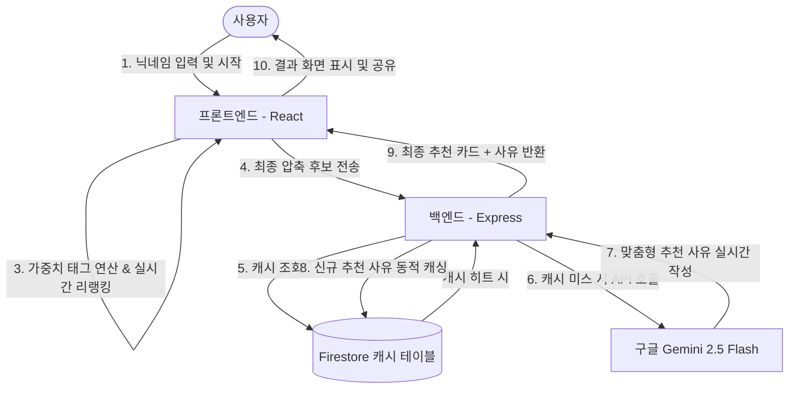

# Gate of Toon (게이트 오브 툰)

> **성좌(Constellation) 테마의 인터랙티브 AI 웹툰 추천 솔루션 및 풀스택 모노레포**
> 
> *본 프로젝트는 사용자의 성향 선택 정보와 실시간 AI 연산을 결합하여 성좌 피드백 형태로 웹툰을 추천해 주는 인터랙티브 웹 서비스입니다.*

---

## 목차
1. [프로젝트 개요 및 기획 배경](#1-프로젝트-개요-및-기획-배경)
2. [핵심 특징 및 사용자 경험 (UX/UI)](#2-핵심-특징-및-사용자-경험-uxui)
3. [시스템 아키텍처 및 데이터 흐름](#3-시스템-아키텍처-및-데이터-흐름)
4. [주요 기능 상세](#4-주요-기능-상세)
5. [기술 스택 (Tech Stack)](#5-기술-스택-tech-stack)
6. [폴더 구조 (Monorepo)](#6-폴더-구조-monorepo)
7. [시작 가이드 (설치 및 실행)](#7-시작-가이드-설치-및-실행)
8. [성능 최적화 및 운영 비용 방어 전략](#8-성능-최적화-및-운영-비용-방어-전략)

---

## 1. 프로젝트 개요 및 기획 배경

### 초기 기획: "툰 시그널 (Toon Signal)"
본 프로젝트는 질의 응답을 결합하여 사용자의 선호 장르를 좁혀가는 웹툰 가이드 서비스 아이디어에서 출발했습니다. 
단순 목록 제공 방식에서 벗어나 사용자 반응에 최적화된 추천 시스템을 구축하고자 하였으며, 특히 AI 연산 단가를 낮추기 위해 1회 추천 비용을 최소화하는 설계를 지향했습니다.

### 최종 구성: "게이트 오브 툰 (Gate of Toon)"
초기 기획안을 바탕으로 웹소설 독자층의 감성에 맞춘 성좌 테마를 적용했습니다. 
자이로 센서 기반 레이아웃 파이프라인, 성좌 반응형 피드백, 그리고 생성형 AI(Gemini 2.5 Flash) 기반의 맞춤형 추천 사유 생성 기능을 결합하여 시스템을 구축했습니다.

---

## 2. 핵심 특징 및 사용자 경험 (UX/UI)

*   **성좌 피드백**: 사용자가 선택지를 입력할 때마다 실시간으로 상태창 영역에 대화형 피드백을 출력합니다.
*   **자이로스코프 패럴랙스 (Gyro-Parallax) 연출**: 모바일 기기의 자이로 센서 물리 값을 분석하여 은하수와 별자리 배경 레이어가 입체적으로 반응하는 3D 코스믹 효과를 브라우저 환경에서 구현했습니다.
*   **실시간 후보군 축소**: 5단계의 질의가 진행되는 동안, 입력된 가중치 조합에 따라 매칭되는 추천 후보군 수가 실시간으로 계산되어 화면에 표시됩니다.

---

## 3. 시스템 아키텍처 및 데이터 흐름

`Gate of Toon`은 하이브리드 캐싱 필터링 아키텍처를 채택하여 API 연산 비용을 관리합니다.



---

## 4. 주요 기능 상세

### A. 동적 리랭킹 시스템
*   각 웹툰 메타데이터는 장르, 분위기, 캐릭터 유형, 스토리 전개 방식 등 가중치 태그를 포함합니다.
*   사용자의 응답에 대응하는 가중치 맵(`OPPOSITE_TAG_MAP`)을 활용하여 실시간으로 후보군 우선순위가 재계산되며 최적화된 결과가 최종 선별됩니다.

### B. 백그라운드 AI 청크 태깅 엔진 (Auto-Tagging System)
*   Firestore에 등록된 웹툰 중 태그 정보가 없는 데이터를 50개 단위 청크(Chunk)로 자동 분류한 뒤, Gemini API를 통해 표준화된 태그를 생성하고 DB를 갱신하는 백그라운드 프로세스를 가동합니다.

### C. 초저비용 캐시 아키텍처
*   사용자가 최종으로 획득한 추천 조합 및 Gemini 생성 사유를 Firestore 데이터베이스 캐시 레이어에 보관하여 불필요한 API 연동 요금 발생을 예방하도록 설계했습니다.

---

## 5. 기술 스택 (Tech Stack)

### Frontend
*   **Library & Framework**: Vite, React, TypeScript
*   **Styling**: Tailwind CSS
*   **Interaction & Device Physics**: Custom Gyro-Parallax Hook, Dynamic Canvas Starfields
*   **Deployment**: Vercel / Firebase Hosting

### Backend
*   **Runtime & Server**: Node.js, Express, TypeScript (TS-Node)
*   **AI Engine**: Google Generative AI SDK (Gemini 2.5 Flash)
*   **Database & Storage**: Google Firebase / Cloud Firestore
*   **State Management**: InMemory Session Store & Background Batch Queue

---

## 6. 폴더 구조 (Monorepo)

본 프로젝트는 통합 관리를 위해 모노레포(Monorepo) 형식으로 설계되었습니다.

```text
📁 gate-of-toon (Root)
├── 📄 README.md (본 문서)
│
├── 📁 frontend (React Client Side)
│    ├── 📁 components (ParallaxBackground, QuestionScreen, ResultScreen 등)
│    ├── 📁 hooks (자이로 연동 useParallax, 게임 흐름 제어 useGameLogic)
│    ├── 📄 App.tsx (상태 머신 기반 렌더링 파이프라인)
│    ├── 📄 package.json (Vite 빌드 설정 및 의존성)
│    └── 📄 tsconfig.json
│
└── 📁 backend (Express API Server)
     ├── 📁 src
     │    ├── 📄 server.ts (Express API, 라우팅 및 백그라운드 태거 실행)
     │    ├── 📄 geminiService.ts (Gemini 연동, 캐싱 레이어 및 Reranking 핵심)
     │    ├── 📄 attachStandardTags.ts (배치 청크 태거 모듈)
     │    ├── 📄 prompts.ts (성좌 관전 페르소나 및 추천 사유 생성 Prompt)
     │    └── 📄 constants.ts (가중치 및 반대 성향 매핑 테이블)
     ├── 📄 package.json (Express & Firebase Admin SDK 의존성)
     └── 📄 tsconfig.json
```

---

## 7. 시작 가이드 (설치 및 실행)

### 1. 환경 변수 설정
*   **프론트엔드 설정**: `frontend/.env.production` 또는 로컬 `.env` 파일을 생성합니다.
    ```env
    VITE_API_URL=http://localhost:5000
    ```
*   **백엔드 설정**: `backend/.env` 파일을 생성합니다.
    ```env
    PORT=5000
    GEMINI_API_KEY=your_google_gemini_api_key_here
    # Firebase Admin SDK의 비공개 키가 포함된 서비스 계정 JSON 경로
    GOOGLE_APPLICATION_CREDENTIALS=./config/firebase-service-account.json
    ```

### 2. 의존성 설치 및 실행

#### 백엔드 서버 기동
```bash
cd backend
npm install
npm run dev
```

#### 프론트엔드 클라이언트 기동
```bash
cd ../frontend
npm install
npm run dev
```

---

## 8. 성능 최적화 및 운영 비용 방어 전략

1.  **동적 API 분기 제어**: 매 질문 단계마다 LLM을 호출하지 않고, 실시간 연산을 프론트엔드 가중치 행렬 계산으로 대체하여 응답 지연 및 호출 비용을 절감하며, 최종 결과 화면 로드 시에만 1회의 실시간 API 호출을 수행합니다.
2.  **Firestore 캐시 최적화**: 생성된 추천 결과물 텍스트를 Firestore 캐시 테이블에 저장하여 중복 결과에 대한 외부 API 호출을 차단하고 서버 트래픽 비용을 관리합니다.
3.  **백그라운드 비동기 큐잉**: 태그 자동 생성 배치는 비동기 큐 구조로 설계되어 메인 추천 스레드 성능에 영향을 주지 않도록 자원을 분배합니다.
