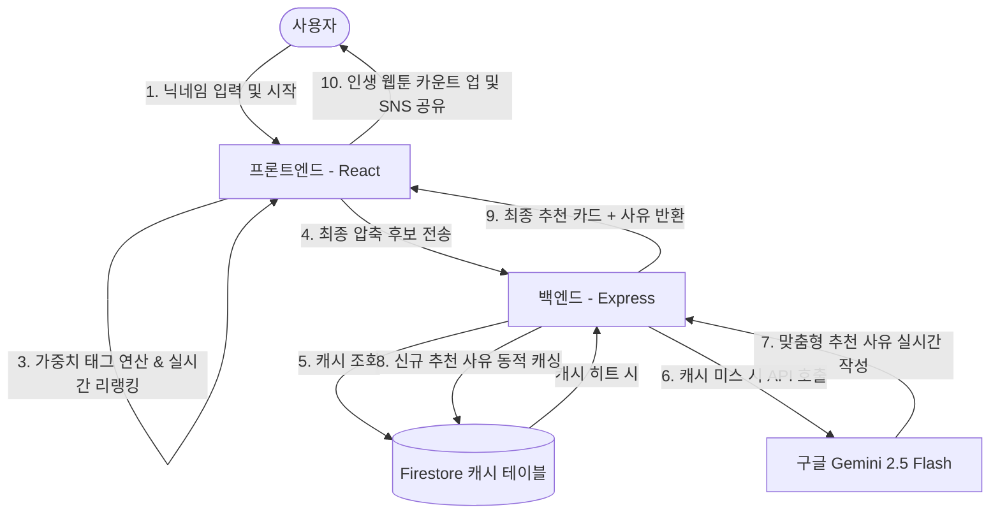

# 🌌 Gate of Toon (게이트 오브 툰)

> **판타지 성좌(Constellation) 테마의 인터랙티브 AI 웹툰 추천 솔루션 및 풀스택 모노레포**
> 
> *본 프로젝트는 웹툰 추천의 단순한 카테고리 필터링을 넘어, 사용자의 선택에 감응하는 '성좌들의 관전 상태창' 컨셉과 실시간 AI 연산을 결합하여, 마치 웹소설 속 주인공이 자신의 운명을 개척해 나가는 듯한 게이밍 경험을 제공하는 인터랙티브 웹 가이드 서비스입니다.*

---

## 📖 목차
1. [프로젝트 개요 및 기획 배경](#1-프로젝트-개요-및-기획-배경)
2. [핵심 차별점 & 사용자 경험 (UX/UI)](#2-핵심-차별점--사용자-경험-uxui)
3. [시스템 아키텍처 & 데이터 흐름](#3-시스템-아키텍처--데이터-흐름)
4. [주요 기능 상세](#4-주요-기능-상세)
5. [기술 스택 (Tech Stack)](#5-기술-스택-tech-stack)
6. [폴더 구조 (Monorepo)](#6-폴더-구조-monorepo)
7. [시작 가이드 (설치 및 실행)](#7-시작-가이드-설치-및-실행)
8. [성능 최적화 및 운영 비용 방어 전략](#8-성능-최적화-및-운영-비용-방어-전략)

---

## 1. 프로젝트 개요 및 기획 배경

### 💡 초기 기획: "툰 시그널 (Toon Signal)"
본 프로젝트는 **'아키네이터(Akinator)식 질의 응답을 결합해 5번의 질문만으로 사용자의 선호를 극도로 좁혀가는 지능형 웹툰 가이드 서비스'**라는 아이디어에서 출발했습니다. 
단순 나열식 목록에서 벗어나 사용자의 심리를 관통하는 추천 시스템을 만들고자 하였으며, 특히 AI 연산 단가를 최적화하여 1회 사용자 추천 비용을 1원 미만으로 유지하는 설계를 지향했습니다.

### 🌌 최종 진화: "게이트 오브 툰 (Gate of Toon)"
초기 기획의 '인도자 상태창' 컨셉을 웹소설/웹툰 핵심 독자층의 감성에 완벽히 부합하도록 **퓨전 판타지 세계관의 '성좌(Constellation)' 테마**로 계승·발전시켰습니다. 
자이로 센서 기반 파이프라인, 실시간 성좌 리액션 댓글 피드백, 그리고 생성형 AI(Gemini 2.5 Flash)가 맞춤 조합하여 제공하는 독창적인 최종 추천 사유가 결합되어 시각적 충격과 몰입도 높은 연출을 완성했습니다.

---

## 2. 핵심 차별점 & 사용자 경험 (UX/UI)

*   **성좌(Constellation)의 관전 피드백**: 사용자가 선택지를 고를 때마다, 심리 분석을 마친 성좌들이 실시간으로 상태창에 난입하여 칭찬, 경악, 흥미 등의 대화형 리액션을 던집니다.
*   **자이로스코프 패럴랙스 (Gyro-Parallax) 연출**: 모바일 스마트폰의 자이로 센서 물리 값을 실시간 파싱하여, 화면의 은하수와 별자리 배경이 입체적으로 넘실거리는 하이엔드 3D 코스믹 이펙트를 브라우저 표준 웹 환경에서 구현했습니다.
*   **역동적인 실시간 후보군 축소**: 5단계의 질의가 진행되는 동안, 사용자의 태그 가중치 조합에 매칭되는 실시간 웹툰 추천 후보군의 수가 화면 상단에서 애니메이션과 함께 카운트다운되어 긴장감 있는 재미를 선사합니다.

---

## 3. 시스템 아키텍처 & 데이터 흐름

`Gate of Toon`은 프론트엔드와 백엔드가 유기적으로 통신하며, 서버 비용을 극단적으로 방어하는 **하이브리드 캐싱 필터링 아키텍처**를 채택했습니다.



---

## 4. 주요 기능 상세

### 🔍 A. 아키네이터 기반 동적 리랭킹 시스템
*   각 웹툰 메타데이터는 장르, 분위기, 캐릭터 유형, 스토리 전개 방식 등 복합적인 가중치 태그를 보유하고 있습니다.
*   사용자의 응답에 대응하는 가중치 맵(`OPPOSITE_TAG_MAP`)을 활용하여 실시간으로 후보군의 우선순위가 재계산되며, 상위 1~3개의 최적화된 웹툰이 최종 엄선됩니다.

### 🤖 B. 백그라운드 AI 청크 태깅 엔진 (Auto-Tagging System)
*   관리자가 수많은 웹툰의 태그를 일일이 수동으로 입력하지 않아도 작동합니다.
*   서버 실행 시 백그라운드 데몬 프로세스가 기동되어, Firestore에 등록된 만화 중 태그 정보가 유실된 데이터를 **50개 단위 청크(Chunk)로 자동 분류**한 뒤 Gemini API를 활용해 고해상도의 표준화 태그를 자동 부착하고 DB에 갱신합니다.

### 💾 C. 1인 개발자를 위한 초저비용 캐시 아키텍처
*   사용자가 최종으로 받게 되는 추천 조합에 대한 Gemini 생성 사유를 Firestore 데이터베이스 캐시 레이어에 보관합니다.
*   반복 유입되는 사용자들에 대해 **서버 및 API 연동 요금 0원**에 수렴하도록 최적화된 설계가 적용되었습니다.

---

## 5. 기술 스택 (Tech Stack)

### 💻 Frontend
*   **Library & Framework**: Vite, React, TypeScript
*   **Styling**: Tailwind CSS
*   **Interaction & Device Physics**: Custom Gyro-Parallax Hook, Dynamic Canvas Starfields
*   **Deployment**: Vercel / Firebase Hosting (무료 호스팅 규격 완벽 대응)

### ⚙️ Backend
*   **Runtime & Server**: Node.js, Express, TypeScript (TS-Node)
*   **AI Engine**: Google Generative AI SDK (Gemini 2.5 Flash)
*   **Database & Storage**: Google Firebase / Cloud Firestore (NoSQL 데이터 연동)
*   **State Management**: InMemory Session Store & Background Batch Queue

---

## 6. 폴더 구조 (Monorepo)

본 프로젝트는 프론트엔드와 백엔드의 유기적인 통합 관리 및 깃허브 관리 효율성을 위해 **모노레포(Monorepo)** 형식으로 완벽하게 통합 설계되었습니다.

```text
📁 gate-of-toon (Root)
├── 📄 README.md (본 문서)
│
├── 📁 frontend (React Client Side)
│    ├── 📁 components (ParallaxBackground, QuestionScreen, ResultScreen 등)
│    ├── 📁 hooks (자이로 연동 useParallax, 게임 흐름 제어 useGameLogic)
│    ├── 📄 App.tsx (상태 머신 기반 렌더링 파이프라인)
│    ├── 📄 package.json (Vite 빌드 설정 및 의존성)
│    └── 📄 tsconfig.json
│
└── 📁 backend (Express API Server)
     ├── 📁 src
     │    ├── 📄 server.ts (Express API, 라우팅 및 백그라운드 태거 실행)
     │    ├── 📄 geminiService.ts (Gemini 연동, 캐싱 레이어 및 Reranking 핵심)
     │    ├── 📄 attachStandardTags.ts (배치 청크 태거 모듈)
     │    ├── 📄 prompts.ts (성좌 관전 페르소나 및 추천 사유 생성 Prompt)
     │    └── 📄 constants.ts (가중치 및 반대 성향 매핑 테이블)
     ├── 📄 package.json (Express & Firebase Admin SDK 의존성)
     └── 📄 tsconfig.json
```

---

## 7. 시작 가이드 (설치 및 실행)

### 🔑 1. 환경 변수 설정
*   **프론트엔드 설정**: `frontend/.env.production` 또는 로컬 `.env` 파일을 생성합니다.
    ```env
    VITE_API_URL=http://localhost:5000
    ```
*   **백엔드 설정**: `backend/.env` 파일을 생성합니다.
    ```env
    PORT=5000
    GEMINI_API_KEY=your_google_gemini_api_key_here
    # Firebase Admin SDK의 비공개 키가 포함된 서비스 계정 JSON 경로
    GOOGLE_APPLICATION_CREDENTIALS=./config/firebase-service-account.json
    ```

### ⚙️ 2. 의존성 설치 및 실행

#### 백엔드 서버 기동
```bash
cd backend
npm install
npm run dev # ts-node-dev 기반 핫 리로딩 실행
```

#### 프론트엔드 클라이언트 기동
```bash
cd ../frontend
npm install
npm run dev # Vite 개발 서버 실행
```

---

## 8. 성능 최적화 및 운영 비용 방어 전략

1.  **동적 API 분기 제어**: 질문 단계마다 매번 LLM을 호출하면 높은 비용과 심각한 응답 지연이 수반됩니다. `Gate of Toon`은 실시간 질문 단계 연산을 프론트엔드 자바스크립트 가중치 행렬로 완전히 대체하여 연산 단가를 **호출당 0원**으로 유지하고, 최종 결과 화면 로딩 시점에만 단 1회의 실시간 API 호출을 수행합니다.
2.  **Firestore 캐시 적중률 최적화**: 사용자들이 몰리는 피크 시간대에도 서버 유료 한도를 넘지 않도록, 추천 결과물 텍스트를 Firestore 캐시 테이블에 만료 기한과 함께 정교하게 영구 보관합니다. 동일 결과에 대한 API 트래픽을 차단해 대규모 트래픽 발생 시에도 인프라 한도를 완벽하게 준수합니다.
3.  **백그라운드 비동기 큐잉**: 데이터 수동 태깅 리소스를 없애기 위한 태깅 배치는 서버의 CPU 파이프라인 리소스를 저해하지 않도록 청크 단위 비동기 큐 구조로 구성되어 메인 추천 스레드 성능에 영향을 주지 않습니다.
